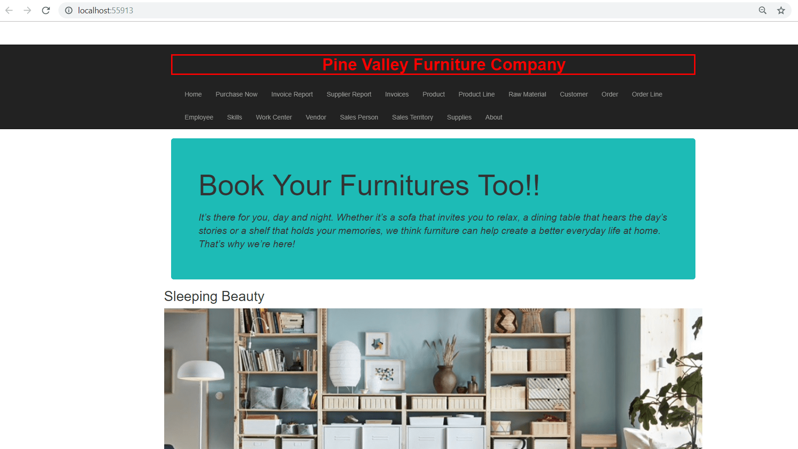
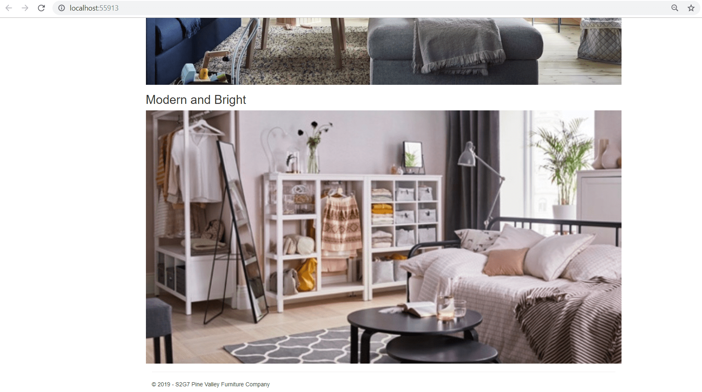
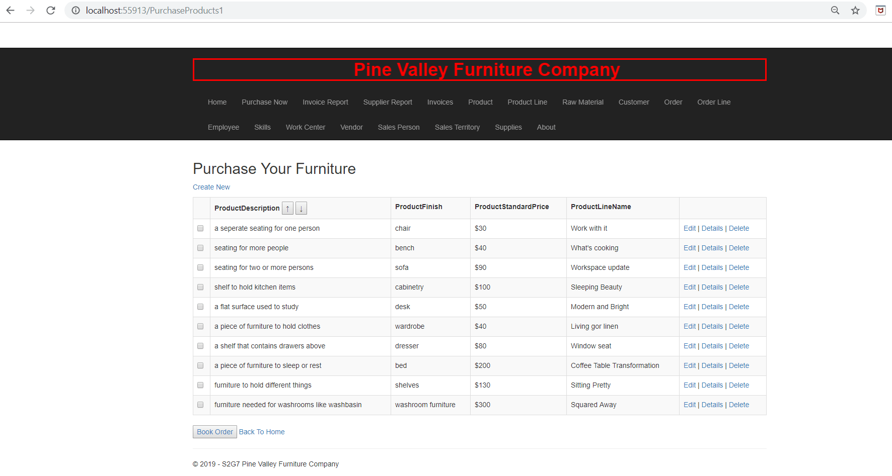
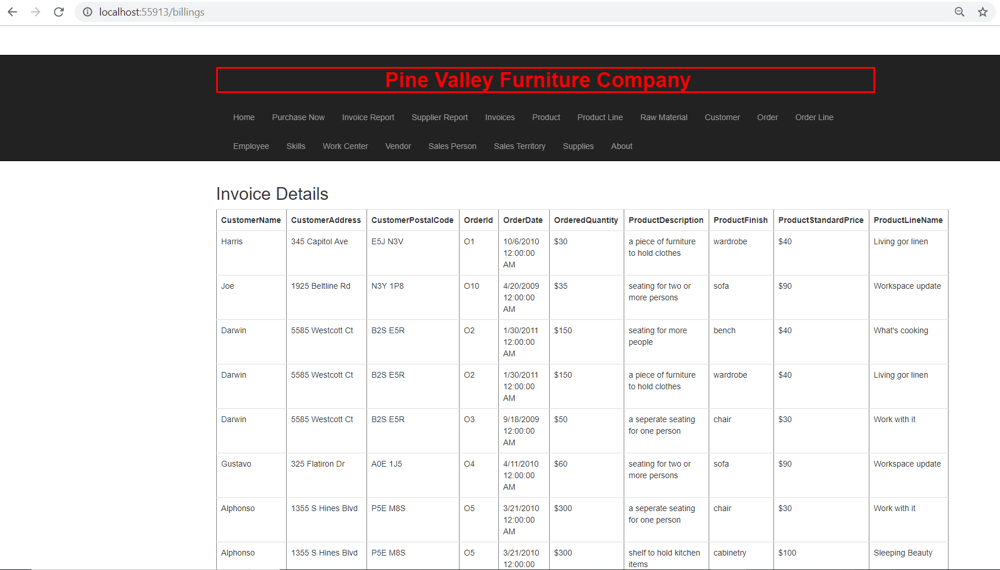
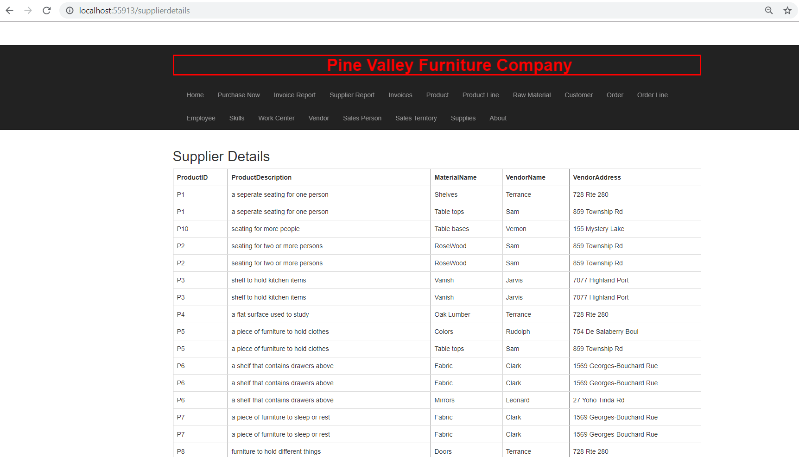

# A FURNITURE COMPANY'S WEB APPLICATION

> This Web Application is a Academic Project which mainly focused on Requirement Analysis, Database Designing and Database Modeling, built using ASP.NET MVC C#, MS SQL Server, HTML5, CSS3, Bootstrap, JavaScript

## Table of contents
* [Technologies](#technologies)
* [Running the Application](#running-the-application)
* [Screenshots](#screenshots)
* [Contact](#contact)

## Technologies
* Web Framework - ASP.NET MVC C#
* Database - MS SQL Server
* Web Technologies - HTML5, CSS3, JavaScript, Bootstrap
* IDE Tool - Microsoft Visual Studio

## Running the Application
* Step 1: Import the database back up file with .bak extension into MS SQL SERVER by clicking on Restore Database from file. Then, select this file and Database will be created.
* Step 2: Open the project in Visual Studio and connect it to the database by clicking on the Add Database Connection.
* Step 3: Once the database is connected, Click on View without debugging option, the Web Application will run on your localhost system.

## Screenshots
 

## Contact
[Sabiha Begum Jaggir Hussain](https://sabihabegumj.com/) - feel free to contact me!
